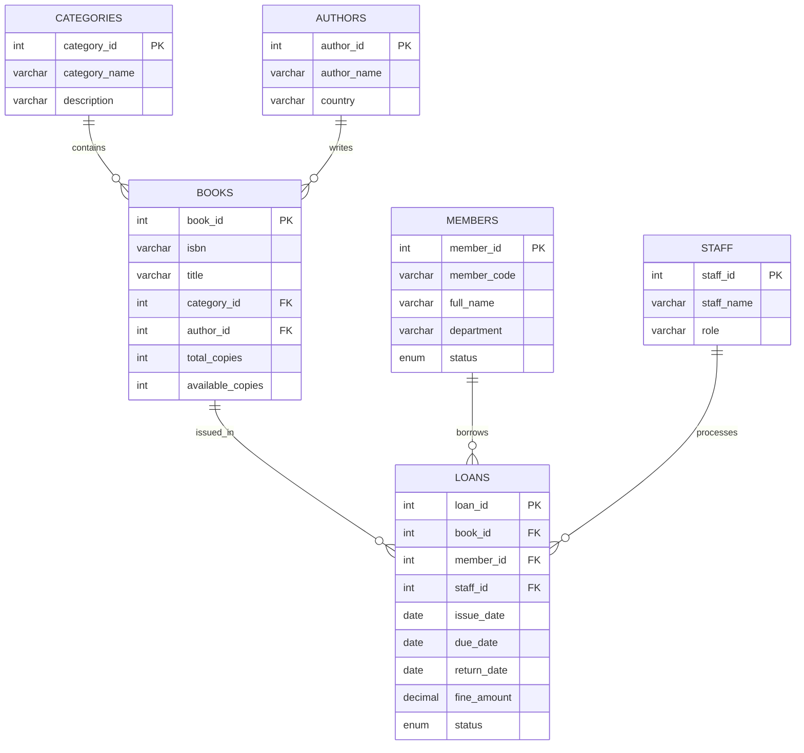

# Library Management System SQL Mini Project

## Project Overview

This mini project is a medium-level **Library Management System** built with **MySQL**. It is suitable for college DBMS practicals because it includes database design, relational constraints, sample data, joins, grouping, views, stored procedures, triggers, and sample query outputs.

The complete executable SQL file is:

```text
library_management_system.sql
```

## Database Design

Database name:

```sql
library_management_system
```

The system manages books, authors, categories, students/members, library staff, and book issue/return records.

## Tables

| Table | Purpose | Primary Key |
|---|---|---|
| `categories` | Stores book categories such as Database, Programming, AI | `category_id` |
| `authors` | Stores author details | `author_id` |
| `books` | Stores book details and copy availability | `book_id` |
| `members` | Stores student/member information | `member_id` |
| `staff` | Stores librarian/staff details | `staff_id` |
| `loans` | Stores issue and return transactions | `loan_id` |

## Primary Keys and Foreign Keys

| Table | Key Type | Column | References |
|---|---|---|---|
| `categories` | Primary Key | `category_id` | - |
| `authors` | Primary Key | `author_id` | - |
| `books` | Primary Key | `book_id` | - |
| `books` | Foreign Key | `category_id` | `categories(category_id)` |
| `books` | Foreign Key | `author_id` | `authors(author_id)` |
| `members` | Primary Key | `member_id` | - |
| `staff` | Primary Key | `staff_id` | - |
| `loans` | Primary Key | `loan_id` | - |
| `loans` | Foreign Key | `book_id` | `books(book_id)` |
| `loans` | Foreign Key | `member_id` | `members(member_id)` |
| `loans` | Foreign Key | `staff_id` | `staff(staff_id)` |

## ER Diagram Explanation

Text-based ER relationship:

```text
categories 1 ---- many books
authors    1 ---- many books
books      1 ---- many loans
members    1 ---- many loans
staff      1 ---- many loans
```

Explanation:

- One category can contain many books, but each book belongs to one category.
- One author can write many books, but each book record stores one main author.
- One book can be issued many times over time, so `books` has a one-to-many relationship with `loans`.
- One member can borrow many books over time, so `members` has a one-to-many relationship with `loans`.
- One staff member can process many issue/return records, so `staff` has a one-to-many relationship with `loans`.

Mermaid ER diagram:



## Dataset Size

The SQL script contains a medium-level dataset:

| Entity | Records |
|---|---:|
| Categories | 8 |
| Authors | 12 |
| Books | 20 |
| Members | 15 |
| Staff | 5 |
| Loans | 25 |

## Views

### 1. `vw_book_details`

Shows book information with category and author names.

### 2. `vw_active_loans`

Shows currently issued books with member details and late-day calculation.

### 3. `vw_member_borrowing_summary`

Shows total books borrowed, current borrow count, and total fine paid by each member.

## Stored Procedures

### 1. `sp_issue_book`

Issues a book to an active member.

Rules included:

- Member must exist.
- Member must be active.
- Book must exist.
- Book must have available copies.
- A member can have maximum 3 active loans.

Example:

```sql
CALL sp_issue_book(19, 6, 1);
```

### 2. `sp_return_book`

Returns an active loan and calculates fine automatically.

Example:

```sql
CALL sp_return_book(14);
```

### 3. `sp_member_loan_history`

Displays borrowing history of a selected member.

Example:

```sql
CALL sp_member_loan_history(1);
```

## Triggers

### 1. `trg_loans_before_insert`

Validates book availability before issuing and prevents duplicate active loans for the same book/member pair.

### 2. `trg_loans_after_insert`

Automatically decreases `available_copies` when a book is issued.

### 3. `trg_loans_before_update`

Updates loan status and calculates fine when a book is returned.

Fine rule:

```text
Fine = late days * 5
```

### 4. `trg_loans_after_update`

Automatically increases `available_copies` when a book is returned.

## Important SQL Queries

### Query 1: Book List With Category and Author

```sql
SELECT title, category_name, author_name, publisher, available_copies
FROM vw_book_details
ORDER BY category_name, title;
```

Sample output:

| title | category_name | author_name | publisher | available_copies |
|---|---|---|---|---:|
| AI Programming with Python | Artificial Intelligence | Peter Norvig | Addison Wesley | 2 |
| Artificial Intelligence: A Modern Approach | Artificial Intelligence | Stuart Russell | Pearson | 2 |
| Database System Concepts | Database | Abraham Silberschatz | McGraw Hill | 4 |
| Fundamentals of Database Systems | Database | Ramez Elmasri | Pearson | 5 |

### Query 2: Active Loans Using Joins

```sql
SELECT
    al.loan_id,
    al.member_code,
    al.full_name,
    al.department,
    al.title,
    al.issue_date,
    al.due_date,
    al.status
FROM vw_active_loans al
ORDER BY al.due_date;
```

Sample output:

| loan_id | member_code | full_name | title | due_date | status |
|---:|---|---|---|---|---|
| 14 | STU014 | Tanya Bose | AI Programming with Python | 2026-04-16 | OVERDUE |
| 15 | STU015 | Rahul Jain | HTML and CSS: Design and Build Websites | 2026-04-18 | OVERDUE |
| 16 | STU003 | Rohan Gupta | Fundamentals of Database Systems | 2026-04-19 | OVERDUE |
| 21 | STU010 | Isha Patel | Java: The Complete Reference | 2026-05-09 | ISSUED |

### Query 3: Overdue Books With Estimated Fine

```sql
SELECT
    member_code,
    full_name,
    title,
    due_date,
    days_late,
    days_late * 5 AS estimated_fine
FROM vw_active_loans
WHERE due_date < CURRENT_DATE
ORDER BY days_late DESC;
```

Sample output assuming `CURRENT_DATE = '2026-05-07'`:

| member_code | full_name | title | due_date | days_late | estimated_fine |
|---|---|---|---|---:|---:|
| STU014 | Tanya Bose | AI Programming with Python | 2026-04-16 | 21 | 105 |
| STU015 | Rahul Jain | HTML and CSS: Design and Build Websites | 2026-04-18 | 19 | 95 |
| STU003 | Rohan Gupta | Fundamentals of Database Systems | 2026-04-19 | 18 | 90 |

### Query 4: Total Books in Each Category

```sql
SELECT
    c.category_name,
    COUNT(b.book_id) AS total_titles,
    SUM(b.total_copies) AS total_copies,
    SUM(b.available_copies) AS available_copies
FROM categories c
LEFT JOIN books b ON c.category_id = b.category_id
GROUP BY c.category_id, c.category_name
ORDER BY total_titles DESC;
```

Sample output:

| category_name | total_titles | total_copies | available_copies |
|---|---:|---:|---:|
| Programming | 5 | 28 | 26 |
| Networking | 3 | 10 | 8 |
| Artificial Intelligence | 2 | 6 | 4 |
| Database | 2 | 11 | 9 |

### Query 5: Most Borrowed Books

```sql
SELECT
    b.title,
    a.author_name,
    COUNT(l.loan_id) AS times_borrowed
FROM books b
JOIN authors a ON b.author_id = a.author_id
LEFT JOIN loans l ON b.book_id = l.book_id
GROUP BY b.book_id, b.title, a.author_name
ORDER BY times_borrowed DESC, b.title
LIMIT 5;
```

Sample output:

| title | author_name | times_borrowed |
|---|---|---:|
| Artificial Intelligence: A Modern Approach | Stuart Russell | 2 |
| Clean Code | Herbert Schildt | 2 |
| Database System Concepts | Abraham Silberschatz | 2 |
| Discrete Mathematics and Its Applications | Thomas H. Cormen | 2 |
| Fundamentals of Database Systems | Ramez Elmasri | 2 |

### Query 6: Borrowing Count by Department

```sql
SELECT
    m.department,
    COUNT(l.loan_id) AS total_issues,
    SUM(CASE WHEN l.return_date IS NULL THEN 1 ELSE 0 END) AS active_issues
FROM members m
LEFT JOIN loans l ON m.member_id = l.member_id
GROUP BY m.department
ORDER BY total_issues DESC;
```

Sample output:

| department | total_issues | active_issues |
|---|---:|---:|
| Computer Science | 7 | 3 |
| Information Technology | 7 | 3 |
| Data Science | 4 | 2 |
| Cyber Security | 4 | 2 |

### Query 7: Fine Collection by Month

```sql
SELECT
    DATE_FORMAT(return_date, '%Y-%m') AS return_month,
    SUM(fine_amount) AS total_fine_collected
FROM loans
WHERE return_date IS NOT NULL
GROUP BY DATE_FORMAT(return_date, '%Y-%m')
ORDER BY return_month;
```

Sample output:

| return_month | total_fine_collected |
|---|---:|
| 2026-01 | 0.00 |
| 2026-02 | 20.00 |
| 2026-03 | 35.00 |
| 2026-04 | 90.00 |

### Query 8: Members Who Have Not Borrowed Any Book

```sql
SELECT
    m.member_code,
    m.full_name,
    m.department
FROM members m
LEFT JOIN loans l ON m.member_id = l.member_id
WHERE l.loan_id IS NULL;
```

Sample output:

| member_code | full_name | department |
|---|---|---|
| STU011 | Arjun Das | Electronics |

## How to Run

1. Open MySQL Workbench.
2. Open `library_management_system.sql`.
3. Run the full script.
4. Use the queries at the end of the file for practical output screenshots.

## Conclusion

This project demonstrates a practical library database with normalized tables, relational integrity, book issue/return tracking, fine calculation, views for reporting, stored procedures for common operations, and triggers for automatic stock updates.

